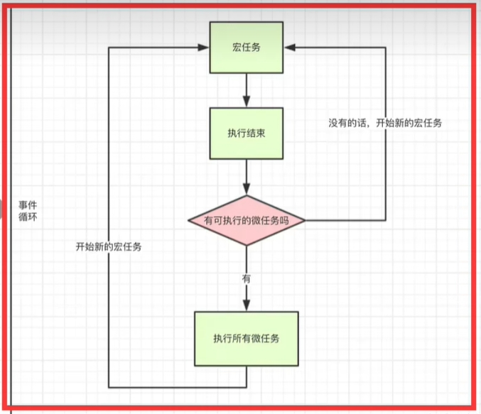
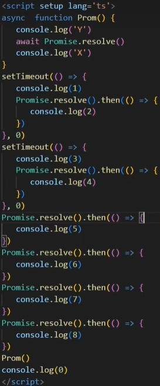

## javascript执行机制
- js 是单线程的如果是多线程的话会引发一个问题在同一时间同时操作DOM 一个增加一个删除JS就不知道到底要干嘛了，所以这个语言是单线程的但是随着HTML5到来js也支持了多线程webWorker 但是也是不允许操作DOM
- 单线程就意味着所有的任务都需要排队，后面的任务需要等前面的任务执行完才能执行，如果前面的任务耗时过长，后面的任务就需要一直等，一些从用户角度上不需要等待的任务就会一直等待，这个从体验角度上来讲是不可接受的，所以JS中就出现了异步的概念。
- 同步任务:代码从上到下执行
- 异步任务
  - 1.宏任务：script、setTimeout、setInterval、UI交换事件、postMessage、Ajax
  - 2.微任务：Promise.then catch finally、MutationObserver、process.nextTick
  - 执行顺序
  - -所有的同步任务都是在主进程执行的形成一个执行栈，主线程之外，还存在一个"任务队列"，异步任务执行队列中先执行宏任务，然后清空当次宏任务中的所有微任务，然后进行下一个tick如此形成循环。
    - 
- 例子
  - 
  - 运行结果:Y 0 5 6 7 8 X 1 2 3 4

## nextTick
- vue更新dom是异步的，数据更新是同步的
- 当我们操作dom的时候发现数据读取的是上次的，就需要使用nextTick
- 如何理解Tick？
  - 例如我们显示器是60FPS
  - 那浏览器绘制一帧就是1000 / 60  ≈ 16.6ms
  - 那浏览器这一帧率做了什么
  - 1.处理用户的事件，就是event 例如 click，input change 等。
  - 2.执行定时器任务
  - 3.执行 requestAnimationFrame
  - 4.执行dom 的回流与重绘
  - 5.计算更新图层的绘制指令
  - 6.绘制指令合并主线程 如果有空余时间会执行 requestidlecallback
